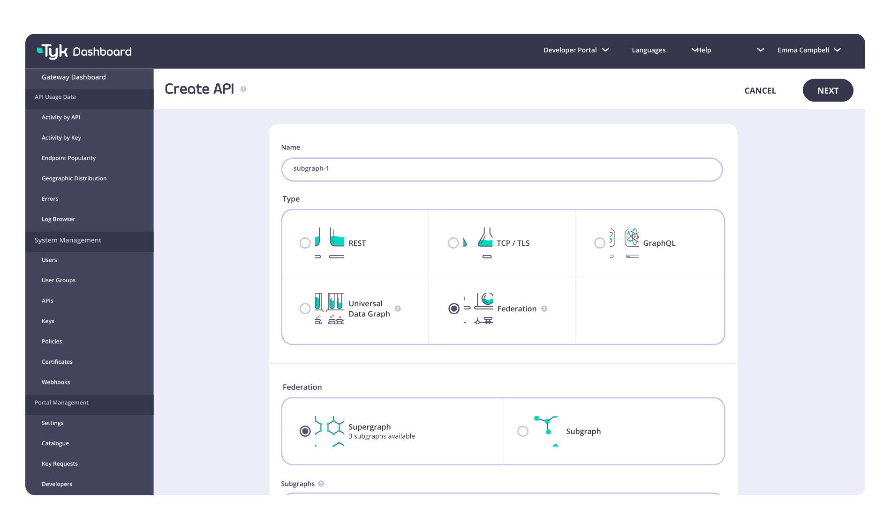

<p align="center">
    <a href="https://www.tyk.io">
    
    </a>
</p>

<p align="center">
Open source enterprise-ready API gateway that is powerful, secure and lightweight. Supports REST, GraphQL, TCP and gRPC protocols.
</p>

<!-- [](https://travis-ci.org/TykTechnologies/tyk) -->
<p align="center">
    <a href="https://goreportcard.com/report/github.com/TykTechnologies/tyk">
    
    </a>
    <a href="https://app.fossa.io/projects/git%2Bgithub.com%2FTykTechnologies%2Ftyk?ref=badge_shield">
    
    </a>
    <a href="https://www.tyk.io">
    
    </a>
</p>

<p align="center">
    <a href="https://www.tyk.io">
    
    </a>
</p>

Tyk Gateway is built from the ground up to be the fastest API gateway on the planet. It does not depend on a legacy proxy underneath and has no 3rd party dependencies aside from Redis for distributed rate-limiting and token storage. 
Tyk Gateway can also be deployed as part of Tyk’s complete full lifecycle API management platform which also includes a management control plane, a dashboard GUI and a developer Portal. [More about Tyk API Management platform features here.](https://tyk.io/docs/apim/open-source/)


# 🚀 Getting Started

## Installing Tyk

- [Docker](https://tyk.io/docs/tyk-oss/ce-docker/) (Recommended method)
- [Kubernetes-Native](https://github.com/TykTechnologies/tyk-oss-k8s-deployment)
- [Kubernetes-Helm](https://github.com/TykTechnologies/tyk-helm-chart#install-tyk-community-edition)
- [Ansible](https://tyk.io/docs/tyk-oss/ce-ansible/)
- [Red Hat](https://tyk.io/docs/tyk-oss/ce-redhat/)  
- [Ubuntu](https://tyk.io/docs/tyk-oss/ce-ubuntu/)  
- [CentOS](https://tyk.io/docs/tyk-oss/ce-centos/) 

## Compile from Source

```
git clone https://github.com/TykTechnologies/tyk
go build
```

Go version 1.12 is required to build `master`, the current development version. Tyk is officially supported on `linux/amd64`, `linux/i386` and `linux/arm64`.

Tests are run against both Go versions 1.12, 1.13, 1.14 and 1.15, however at present, only Go 1.12 is officially supported.

In order to run tests locally use the following command:

```
go test ./...
```

Note that tests require Redis to be running on the same machine (default port). In order to write your own tests, please [refer to this guide](https://github.com/TykTechnologies/tyk/blob/master/TESTING.md)

## Documentation

All the documentation of Tyk Gateway and other tools from Tyk [can be found here.](https://tyk.io/docs/tyk-oss-gateway/)


# ⚙️ Tyk Integrations

Here are our other tools which can be used with Tyk Gateway:

- [Tyk Pump](https://github.com/TykTechnologies/tyk-pump) - Pluggable analytics purger to move Analytics generated by your Tyk nodes to any back-end.
- [Tyk Operator](https://github.com/TykTechnologies/tyk-operator) - Brings API Management capabilities to Kubernetes. Configure Ingress, APIs, Security Policies, Authentication, Authorization, Mediation and more - all using Custom Resources and Kubernetes Native primitives
- [Tyk Identity Broker](https://github.com/TykTechnologies/tyk-identity-broker) - Tyk Authentication Proxy for third-party login
- [Tyk Sync ](https://github.com/TykTechnologies/tyk-sync)- Command line tool and library to manage and synchronise a Tyk installation with your version control system (VCS).
- [Tyk Mserv](https://github.com/TykTechnologies/mserv) - Asset Server and gRPC host


# 💻  Contributing

We welcome feedback, ideas and contributions to improve Tyk! 💜

For more information about contributing code and giving feedback, see our [Contributing Guidelines](https://github.com/TykTechnologies/tyk/blob/master/CONTRIBUTING.md).


# 👥 Community

*   [Join the community forum](https://community.tyk.io) - Get technical support, product updates and latest announcements
*   [File a GitHub Issue](https://github.com/TykTechnologies/tyk/issues/new/choose) - File your feature requests & bug reports
*   [Read our blog](https://tyk.io/blog/) - Access tutorials, insights, and product announcements
*   [Join our events](https://tyk.io/webinars) - Join our events for Tyk users and the API community
*   Follow us on [LinkedIn](https://www.linkedin.com/company/tyk/) and [Twitter](http://twitter.com/tyk_io)
*   [Listen to our All About APIs podcast](https://tyk.io/all-about-apis-podcast/) - Learn best practices and get insights from experts in the API industry


If you like Tyk, we would really appreciate it if you can give us a Github star ⭐️ or [leave us a review on G2](https://www.g2.com/products/tyk/reviews)! 🙏


# Open Source License

Tyk is released under the MPL v2.0; please see [LICENSE.md](https://github.com/TykTechnologies/tyk/blob/master/LICENSE.md) for a full version of the license.


