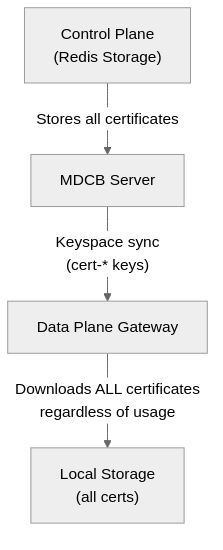
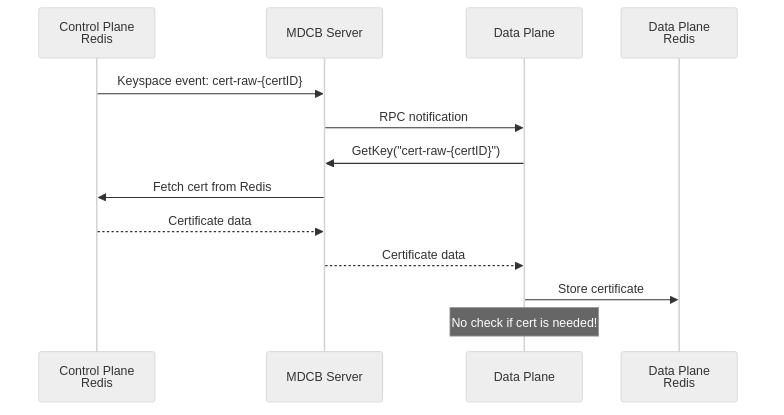
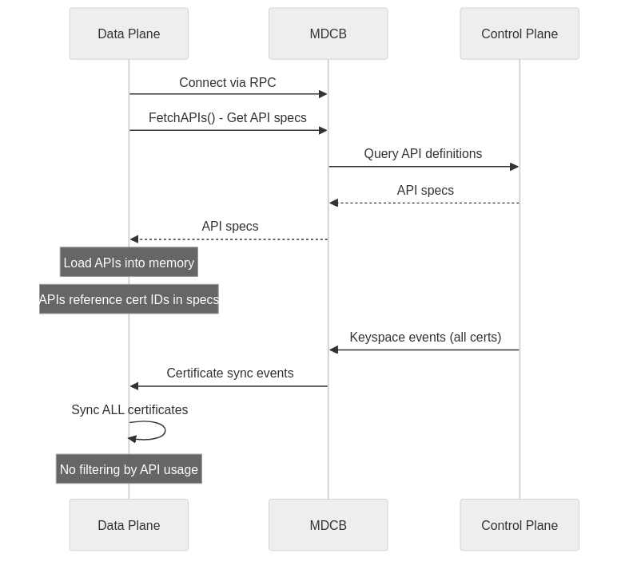
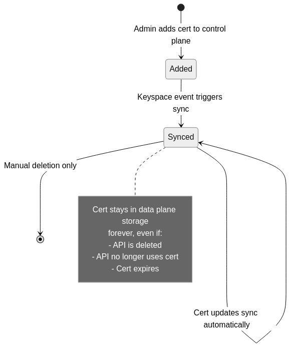
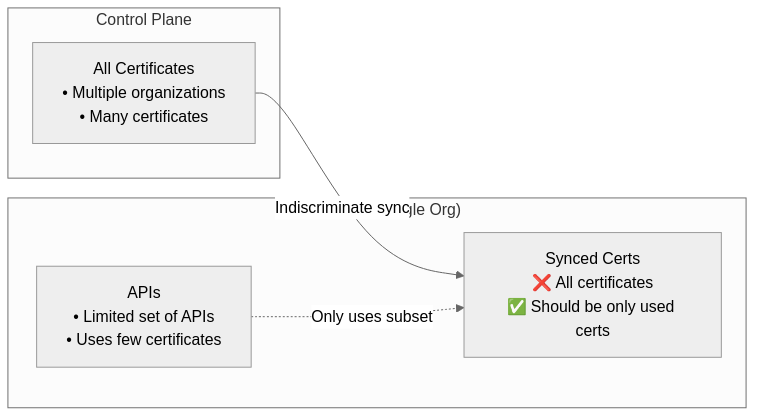
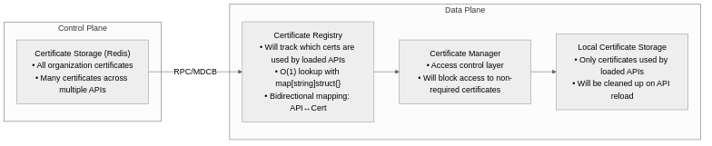
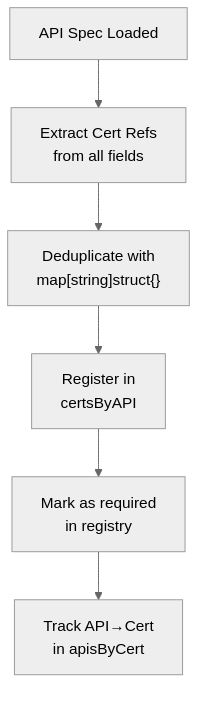
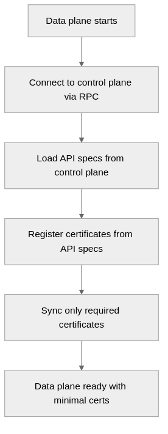
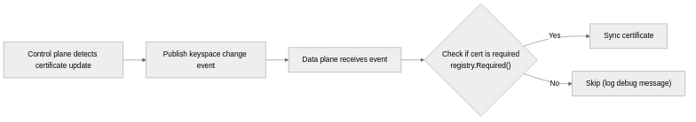
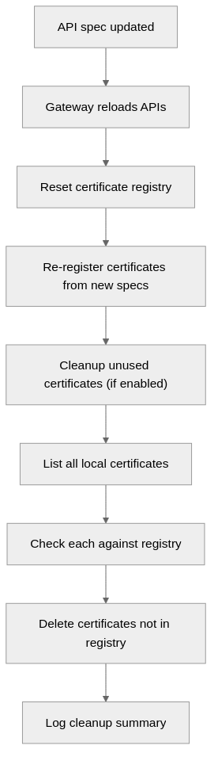

# Selective Certificate Synchronization for MDCB Data Planes

## Overview

This design proposes selective certificate synchronization for Tyk Gateway data planes in MDCB (Multi Data Center Bridge) deployments. Instead of syncing all certificates from the control plane, data planes will only sync certificates that are actually used by their loaded APIs.

**Expected Benefits**:
- **97-98% reduction** in certificate storage on data planes
- **Reduced memory footprint** in segmented deployments
- **Faster synchronization** with fewer certificates to transfer
- **Improved security** with masked certificate IDs in logs
- **O(1) lookup performance** with optimized data structures

## Current State: How MDCB Synchronization Works

### Overview of MDCB Architecture

MDCB (Multi Data Center Bridge) enables a distributed Tyk deployment with a centralized control plane and multiple data plane gateways. The control plane manages all configuration, policies, and certificates, while data planes handle API traffic.

### Current Certificate Synchronization Behavior

In the current implementation, certificate synchronization works as follows:



#### Synchronization Mechanisms

**1. Keyspace Monitoring**

The data plane monitors Redis keyspace events from the control plane:

```go
// In gateway/rpc_storage_handler.go
func (r *RPCStorageHandler) ProcessKeySpaceChanges(keys []string, orgId string) {
    for _, key := range keys {
        // Process ALL certificate changes, no filtering
        if strings.HasPrefix(key, "cert-") {
            // Sync this certificate
            r.syncCertificate(key)
        }
    }
}
```

- Control plane publishes Redis keyspace notifications for certificate changes
- Data planes subscribe to keyspace events via RPC
- When **any** `cert-*` key changes, **all** data planes receive a notification
- Each data plane syncs the certificate regardless of whether it needs it

**2. Certificate Pull (Current Flow)**



Current code in `storage/mdcb_storage.go`:
```go
func (m MdcbStorage) GetKey(key string) (string, error) {
    // Direct RPC call - no filtering logic
    return m.getFromRPCAndCache(key)
}
```

**3. Certificate Access (Current Flow)**

When gateway code needs a certificate:

```go
// In certs/manager.go (BEFORE changes)
func (c *certificateManager) GetRaw(certID string) (string, error) {
    // Direct storage access - no usage check
    return c.storage.GetKey("raw-" + certID)
}
```

The flow:
1. API handler calls `CertificateManager.GetRaw(certID)`
2. Certificate manager directly queries storage
3. If cert exists in local Redis, return it
4. If not in local Redis, fetch from MDCB via RPC
5. **No validation** that this certificate is actually used by any loaded API

**4. Initial Sync (Data Plane Startup)**

When data plane starts:



API specs reference certificates in multiple fields:
```go
type APISpec struct {
    Certificates         []string            // Server certs for custom domains
    ClientCertificates   []string            // Client certs for mTLS
    UpstreamCertificates map[string]string   // Upstream connection certs
    PinnedPublicKeys     map[string]string   // Public key pins
}
```

**Current behavior**: Even though the API spec contains the cert IDs needed, the gateway:
- Does NOT extract or track these cert IDs
- Does NOT filter sync based on these IDs
- Syncs ALL certificates from control plane regardless of API needs

**5. Certificate Lifecycle (Current)**



**Problems**:
- Certificates are never automatically removed from data planes
- No cleanup mechanism when APIs change or are deleted
- No lifecycle management tied to actual usage

### The Problem

**In segmented deployments** (where different data planes serve different API groups):

- **Control Plane**: Stores 100+ certificates across all organizations and APIs
- **Data Plane A**: Serves 2 APIs requiring 2 certificates
  - **Currently syncs**: All 100+ certificates (98% unnecessary)
  - **Storage waste**: ~98 unused certificates
  - **Memory overhead**: Maps, caches, and tracking for unused certs

- **Data Plane B**: Serves 3 APIs requiring 3 certificates
  - **Currently syncs**: All 100+ certificates (97% unnecessary)
  - **Storage waste**: ~97 unused certificates

### Why This Happens



**Root Causes**:

1. **No usage tracking**: Data planes don't track which certificates are actually needed by loaded APIs
2. **No filter mechanism**: Certificate sync logic lacks a way to filter based on API requirements
3. **No cleanup**: Once synced, certificates remain indefinitely even if APIs are removed
4. **Broadcast sync**: Keyspace changes are broadcast to all data planes regardless of relevance

### Impact

**Storage Impact**:
- Data plane with 2 APIs stores 100+ certificates instead of 2
- 50x storage overhead for certificates alone
- Additional memory for certificate metadata, caches, and indices

**Performance Impact**:
- Certificate expiry monitoring checks ALL certificates, including unused ones
- Larger memory footprint affects overall gateway performance
- Slower startup/reload times due to processing unused certificates

**Operational Impact**:
- Log noise from certificate operations on unused certs
- Difficulty troubleshooting cert issues when logs contain irrelevant certs
- Security concern: data planes have access to certificates they don't need

## Proposed Solution: Selective Certificate Synchronization

### Overview

This design proposes a **usage-aware certificate synchronization system** where data planes only sync and store certificates that are actually required by their loaded APIs. Instead of blindly syncing all certificates from the control plane, each data plane will:

1. **Track certificate usage** by analyzing loaded API specifications
2. **Filter synchronization** to only pull required certificates
3. **Enforce access control** to block access to non-required certificates
4. **Clean up automatically** when APIs are removed or changed

### How It Addresses Current Problems

| Problem | Current State | Proposed Solution |
|---------|--------------|-------------------|
| **No usage tracking** | Data planes don't know which certs are needed | Certificate Registry tracks all cert references from loaded APIs |
| **No filter mechanism** | All certificates are synced indiscriminately | Sync logic checks registry before pulling certificates |
| **No cleanup** | Certificates accumulate indefinitely | Automatic cleanup on API reload removes unused certs |
| **Broadcast sync** | All data planes receive all cert updates | Data planes ignore cert changes for unused certificates |
| **Access control** | Any code can access any synced certificate | Certificate Manager blocks access to non-required certs |

### Design Principles

1. **Opt-in and Backward Compatible**
   - Feature disabled by default via config flags
   - Existing deployments continue to work unchanged
   - Gradual rollout per data plane

2. **Application-Layer Enforcement**
   - Access control implemented in CertificateManager, not storage layer
   - Proper separation of concerns
   - Easy to test and maintain

3. **Performance First**
   - O(1) lookup performance using map-based sets
   - Zero-size `struct{}` values for minimal memory overhead
   - Efficient bidirectional tracking (API→Cert and Cert→API)

4. **Security by Default**
   - Certificate IDs masked in all logs to prevent information leakage
   - Access attempts to non-required certificates are blocked and logged
   - Principle of least privilege: data planes only access what they need

5. **Observable and Debuggable**
   - Clear log messages at INFO, DEBUG, and WARN levels
   - Metrics on certificate count and cleanup operations
   - Detailed audit trail of certificate access attempts

### Expected Outcomes

**Before (Current State)**:
```
Control Plane: 100 certificates across all organizations
Data Plane A: Serves 2 APIs
  → Syncs: 100 certificates
  → Uses: 2 certificates (2%)
  → Waste: 98 certificates
```

**After (With Selective Sync)**:
```
Control Plane: 100 certificates across all organizations
Data Plane A: Serves 2 APIs
  → Syncs: 2 certificates (filtered by registry)
  → Uses: 2 certificates (100%)
  → Waste: 0 certificates
  → Reduction: 98% fewer certificates stored
```

**Benefits Summary**:
- **Storage**: 90-98% reduction in certificate storage on data planes
- **Memory**: Proportional reduction in memory for cert metadata and caches
- **Performance**: Faster startup, reload, and expiry checking
- **Security**: Data planes only access certificates they actually need
- **Operations**: Cleaner logs, easier troubleshooting

### High-Level Flow

The solution introduces three main mechanisms:

**1. Certificate Registration (at API load time)**
```
API Spec → Extract Cert IDs → Register in Registry → Mark as Required
```

**2. Selective Synchronization (at sync time)**
```
Keyspace Event → Check Registry → If Required: Sync | If Not: Skip
```

**3. Automatic Cleanup (at API reload time)**
```
API Reload → Reset Registry → Re-register Certs → Delete Unused Certs
```

### Architecture

#### Component Overview



#### Key Components

#### 1. Certificate Registry (`gateway/cert_registry.go`)

The certificate registry will be the core component that tracks which certificates are required by loaded APIs.

**Data Structures**:
```go
type certRegistry struct {
    mu         sync.RWMutex
    required   map[string]struct{}                // certID -> is required
    apisByCert map[string]map[string]struct{}     // certID -> set of API IDs
    certsByAPI map[string]map[string]struct{}     // API ID -> set of cert IDs
}
```

**Performance Characteristics**:
- **O(1)** lookup to check if a certificate is required
- **Zero-size** struct{} values for minimal memory footprint
- **Automatic deduplication** when APIs reference the same certificate multiple times
- **Thread-safe** with RWMutex for concurrent access

**Key Methods**:
- `Required(certID string) bool` - Check if a certificate is used by any loaded API
- `Register(spec *APISpec)` - Extract and track all certificates from an API spec
- `APIs(certID string) []string` - Get list of APIs using a specific certificate
- `Reset()` - Clear all tracked certificates (used during API reload)

#### 2. Certificate Manager (`certs/manager.go`)

Will be enhanced with selective sync support to provide access control at the application layer.

**Key Changes**:
```go
type certificateManager struct {
    // ... existing fields ...

    // New fields for selective sync
    registry      CertRegistry  // Certificate usage registry
    selectiveSync bool          // Whether selective sync is enabled
}

// Access control enforcement
func (c *certificateManager) GetRaw(certID string) (string, error) {
    // Check registry before accessing storage when selective sync is enabled
    if c.selectiveSync && c.registry != nil && !c.registry.Required(certID) {
        c.logger.WithField("cert_id", maskCertID(certID)).
            Info("BLOCKED: certificate not required by loaded APIs")
        return "", errors.New("certificate not required by loaded APIs")
    }
    return c.storage.GetKey("raw-" + certID)
}
```

**Security Enhancement**:
- Certificate IDs are masked in logs: `a1b2c3d4***[len=72]`
- Prevents exposure of sensitive data derived from API keys

#### 3. RPC Storage Handler (`gateway/rpc_storage_handler.go`)

Will filter certificate synchronization during keyspace changes.

**Implementation**:
```go
func (r *RPCStorageHandler) ProcessKeySpaceChanges(keys []string, orgId string) {
    // ... existing code ...

    // Filter certificates during sync
    if r.Gw.GetConfig().SlaveOptions.UseRPC &&
        r.Gw.GetConfig().SlaveOptions.SyncUsedCertsOnly {

        if r.Gw.certRegistry != nil && !r.Gw.certRegistry.Required(certId) {
            log.WithField("cert_id", maskCertID(certId)).
                Debug("skipping certificate - not used by loaded APIs")
            continue
        }

        if r.Gw.certRegistry != nil {
            apis := r.Gw.certRegistry.APIs(certId)
            log.WithFields(logrus.Fields{
                "cert_id": maskCertID(certId),
                "apis":    apis,
            }).Info("syncing required certificate")
        }
    }

    // ... sync the certificate ...
}
```

#### 4. MDCB Storage Layer (`storage/mdcb_storage.go`)

Will filter certificate pulls from MDCB based on registry.

**Implementation**:
```go
func (m MdcbStorage) GetKey(key string) (string, error) {
    resourceType := m.extractResourceType(key)

    // Filter certificate pulls
    if resourceType == resourceCertificate &&
        m.config != nil &&
        m.config.SlaveOptions.UseRPC &&
        m.config.SlaveOptions.SyncUsedCertsOnly &&
        m.certUsage != nil {

        certID := extractCertID(key)
        if certID == "" {
            return m.getFromRPCAndCache(key)
        }

        if !m.certUsage.Required(certID) {
            m.logger.WithField("cert_id", maskCertID(certID)).
                Debug("skipping certificate pull - not used by loaded APIs")
            return "", errors.New("certificate not required")
        }
    }

    return m.getFromRPCAndCache(key)
}
```

#### 5. Certificate Cleanup (`gateway/cert.go`)

Will remove unused certificates after API reload.

**Implementation**:
```go
func (gw *Gateway) cleanupUnusedCerts() {
    // Registry only exists in RPC mode
    if gw.certRegistry == nil {
        return
    }

    // All three flags required (RPC mode + both features enabled)
    if !gw.GetConfig().SlaveOptions.UseRPC ||
        !gw.GetConfig().SlaveOptions.SyncUsedCertsOnly ||
        !gw.GetConfig().SlaveOptions.CleanupCerts {
        return
    }

    // List all certificates
    allCerts := gw.CertificateManager.ListAllIds("")

    var removed int
    for _, certID := range allCerts {
        if gw.certRegistry.Required(certID) {
            continue
        }

        // Extract orgID from certID (format: {orgID}{sha256hash})
        var orgID string
        if len(certID) > sha256.Size*2 {
            orgID = certID[:len(certID)-sha256.Size*2]
        }

        log.WithField("cert_id", maskCertID(certID)).
            Debug("removing unused certificate")

        gw.CertificateManager.Delete(certID, orgID)
        gw.RPCCertCache.Delete("cert-raw-" + certID)
        removed++
    }

    if removed > 0 {
        log.WithField("count", removed).Info("cleaned up unused certificates")
    }
}
```

#### 6. API Loader (`gateway/api_loader.go`)

Will register API certificates with the registry after loading APIs.

**Implementation**:
```go
func (gw *Gateway) loadApps(specs []*APISpec) {
    // ... existing API loading code ...

    // Register certificates from each API
    if gw.certRegistry != nil {
        for _, spec := range specs {
            gw.certRegistry.Register(spec)
        }

        // Log when feature is enabled
        if gw.GetConfig().SlaveOptions.SyncUsedCertsOnly {
            mainLog.WithFields(logrus.Fields{
                "cert_count": gw.certRegistry.Len(),
                "api_count":  len(specs),
            }).Info("sync used certs only enabled")
        }
    }
}
```

#### 7. Certificate Expiry Monitoring (`internal/certcheck/batcher.go`)

Optimized to skip expiry checks for unused certificates.

**Implementation**:
```go
func (c *CertificateExpiryCheckBatcher) RunInBackground() {
    // ... existing code ...

    for certInfo := range c.batch.Iter() {
        // ONLY filter in RPC mode when feature enabled
        if c.gwConfig != nil &&
            c.gwConfig.SlaveOptions.UseRPC &&
            c.gwConfig.SlaveOptions.SyncUsedCertsOnly &&
            c.certUsage != nil {

            if !c.certUsage.Required(certInfo.ID) {
                continue
            }
        }

        // ... perform expiry check ...
    }
}
```

## Configuration

### Config Options

Two new configuration flags in `SlaveOptionsConfig`:

```json
{
  "slave_options": {
    "use_rpc": true,
    "sync_used_certs_only": false,
    "cleanup_certs": false
  }
}
```

#### `sync_used_certs_only`
- **Type**: `boolean`
- **Default**: `false`
- **Description**: Set to `true` to sync only certificates used by loaded APIs. Only applies when `use_rpc` is `true`. Reduces memory usage and log noise in segmented deployments.

#### `cleanup_certs`
- **Type**: `boolean`
- **Default**: `false`
- **Description**: Set to `true` to remove unused certificates on API reload. Only applies when both `use_rpc` and `sync_used_certs_only` are `true`.

### Example Configuration

**Control Plane** (no changes required):
```json
{
  "listen_port": 8080,
  "storage": {
    "type": "redis",
    "host": "localhost",
    "port": 6379
  }
}
```

**Data Plane** (with selective sync enabled):
```json
{
  "listen_port": 8080,
  "slave_options": {
    "use_rpc": true,
    "rpc_key": "your-rpc-key",
    "connection_string": "control-plane:9091",
    "sync_used_certs_only": true,
    "cleanup_certs": true,
    "bind_to_slugs": true,
    "group_id": "datacenter-1"
  },
  "storage": {
    "type": "redis",
    "host": "localhost",
    "port": 6379
  }
}
```

## Certificate Tracking

### Certificate Sources

The registry will track certificates from multiple API spec fields:

1. **`Certificates`** - Server certificates for custom domains
2. **`ClientCertificates`** - Client certificates for mutual TLS
3. **`UpstreamCertificates`** - Certificates for upstream mutual TLS
4. **`PinnedPublicKeys`** - Public key pinning for certificate validation

### Registration Flow



## Synchronization Flow

### Initial Sync



### Live Sync (Keyspace Changes)



### API Reload



## Performance Optimizations

### 1. Zero-Size Set Values

Using `struct{}` instead of `bool` for set implementations:

```go
// Before: 1 byte per entry
required map[string]bool

// After: 0 bytes per entry
required map[string]struct{}
```

**Memory Savings**:
- 10,000 certificates = **10KB saved** on required map alone
- In large deployments: **hundreds of KB to MB saved**

### 2. O(1) Lookup Performance

Replaced linear scans with map lookups:

```go
// Before: O(N) - scan slice for each check
func contains(slice []string, item string) bool {
    for _, a := range slice {
        if a == item {
            return true
        }
    }
    return false
}

// After: O(1) - direct map lookup
func (cr *certRegistry) Required(certID string) bool {
    _, exists := cr.required[certID]
    return exists
}
```

### 3. Automatic Deduplication

Certificates referenced multiple times in an API spec are automatically deduplicated:

```go
// API spec with duplicate cert references
spec := APISpec{
    Certificates:         []string{"cert1", "cert1"},
    ClientCertificates:   []string{"cert1"},
    UpstreamCertificates: map[string]string{"*": "cert1"},
}

// Registry stores only one reference
certSet := make(map[string]struct{})
certSet["cert1"] = struct{}{}  // Only one entry
```

## Security Considerations

### Certificate ID Masking

Certificate IDs can be derived from API keys and should not be logged in clear text.

**Implementation**:
```go
func maskCertID(certID string) string {
    if len(certID) <= 8 {
        return certID
    }
    return certID[:8] + "***[len=" + strconv.Itoa(len(certID)) + "]"
}

// Usage
log.WithField("cert_id", maskCertID(certID)).
    Info("syncing required certificate")

// Output: cert_id=a1b2c3d4***[len=72]
```

**Where Applied**:
- `certs/manager.go` - GetRaw() access control logs
- `gateway/cert.go` - Cleanup operation logs
- `gateway/rpc_storage_handler.go` - Sync operation logs
- `storage/mdcb_storage.go` - Storage layer logs

### Access Control

The CertificateManager will enforce access control at the application layer:

1. **Registry Check**: Before accessing any certificate, check if it's required
2. **Block Non-Required**: Return error if certificate is not in registry
3. **Audit Logging**: Log all blocked access attempts with masked cert IDs

This ensures that even if a certificate exists in storage, it cannot be accessed unless it's registered as required by a loaded API.

## Testing

### Unit Tests

All core packages have comprehensive unit tests:

```bash
# Certificate manager tests
go test ./certs -v

# Storage layer tests
go test ./storage -v

# Certificate expiry monitoring tests
go test ./internal/certcheck -v

# Config schema validation tests
go test ./cli/linter -v
```

### Integration Tests

Certificate-specific integration tests:

```bash
# All certificate integration tests
go test ./gateway -run TestCert -v

# Specific certificate features
go test ./gateway -run TestCertificateCheckMW -v
go test ./gateway -run TestAPICertificate -v
go test ./gateway -run TestUpstreamCertificates -v
```

### Manual Testing

See `MDCB.md` for step-by-step manual testing procedures including:
- Setting up control plane and data plane
- Uploading 100+ test certificates
- Verifying selective sync (97-98% reduction)
- Testing certificate cleanup
- Verifying access control

### Blackbox Testing

Blackbox testing validates the selective certificate synchronization feature through observable behavior without requiring knowledge of internal implementation. Tests verify behavior through storage state, log output, and API functionality.

#### Test Coverage Requirements

**Initial Synchronization**

Data plane starting with selective sync enabled syncs only certificates referenced in loaded API specs. Control plane has many certificates, data plane has few APIs.

Expected behavior:
- Data plane storage contains only required certificates (97-98% reduction)
- Logs indicate selective sync is enabled with certificate and API counts
- APIs function correctly with synced certificates

**Live Sync Filtering**

Data plane ignores certificate updates for certificates not used by loaded APIs. Certificate updated on control plane that is not referenced by any data plane API.

Expected behavior:
- Updated certificate does not appear in data plane storage
- Debug log indicates certificate was skipped

**Required Certificate Sync**

Data plane syncs certificate updates for certificates used by loaded APIs. Certificate updated on control plane that is referenced by data plane API.

Expected behavior:
- Updated certificate appears in data plane storage with new content
- Info log indicates certificate was synced with list of APIs using it
- APIs using certificate continue to function

**Certificate Cleanup**

Data plane removes unused certificates when APIs are reloaded. API references to certificates removed, then API reload triggered.

Expected behavior:
- Previously synced certificates no longer in data plane storage
- Logs indicate cleanup operation with count of removed certificates
- Still-referenced certificates remain in storage

**Access Control**

Application layer blocks access to certificates not required by loaded APIs. Certificate exists in storage but is not referenced by loaded APIs.

Expected behavior:
- Blocked access attempts logged with masked certificate ID

**Certificate Sharing**

Certificates referenced by multiple APIs are tracked correctly. Multiple APIs reference the same certificate.

Expected behavior:
- Certificate appears once in storage
- Logs show which APIs use the certificate
- Removing one API does not remove certificate if still used by others
- Certificate removed only when no APIs reference it

**Deduplication**

Duplicate certificate references within same API spec are deduplicated. API spec references same certificate in multiple fields.

Expected behavior:
- Certificate appears once in storage
- Logs show certificate count equals unique certificates

**Backward Compatibility**

Feature disabled (default configuration) produces original behavior. Both selective sync and cleanup flags disabled.

Expected behavior:
- All certificates from control plane appear in data plane storage
- No selective sync log messages
- Certificate count matches control plane

**Segmented Deployment**

Selective sync works correctly with API group binding. Data plane bound to specific API group, control plane has multiple groups.

Expected behavior:
- Data plane storage contains only certificates for APIs in assigned group
- Certificates for other groups not present in data plane storage

**Certificate Rotation**

Certificate updates propagate correctly with selective sync enabled. Certificate updated on control plane that is currently in use by data plane.

Expected behavior:
- Updated certificate content appears in data plane storage
- APIs continue to function with updated certificate

#### Validation Methods

Tests validate behavior through:

**Storage State**:
- Certificate presence/absence in data plane Redis
- Certificate count comparisons between control and data planes
- Certificate content verification

**Log Output**:
- Selective sync enablement messages
- Certificate sync operations with API lists
- Certificate skip/filter messages
- Cleanup operation summaries
- Access control blocks
- Certificate ID masking format

**API Functionality**:
- mTLS handshake success with client certificates
- Upstream connection establishment with upstream certificates
- Public key pinning validation
- Custom domain certificate usage

**Performance Metrics**:
- Certificate count reduction percentage
- Sync operation timing
- Memory footprint changes

## Monitoring and Observability

### Log Messages

**INFO Level**:
```
info msg="sync used certs only enabled" cert_count=2 api_count=1
info msg="syncing required certificate" cert_id=a1b2c3d4***[len=72] apis=["api1","api2"]
info msg="cleaned up unused certificates" count=98
```

**DEBUG Level**:
```
debug msg="skipping certificate - not used by loaded APIs" cert_id=a1b2c3d4***[len=72]
debug msg="skipping certificate pull - not used by loaded APIs" cert_id=a1b2c3d4***[len=72]
debug msg="removing unused certificate" cert_id=a1b2c3d4***[len=72]
```

**BLOCKED Attempts**:
```
info msg="BLOCKED: certificate not required by loaded APIs" cert_id=a1b2c3d4***[len=72]
```

### Metrics

Monitor these aspects:

1. **Certificate Count**:
   - Before: 100+ certificates in storage
   - After: 2-3 certificates in storage
   - Reduction: 97-98%

2. **Memory Usage**:
   - Registry memory: ~0 bytes per certificate (struct{})
   - Storage reduction: ~MB per 1000 unused certificates

3. **Sync Performance**:
   - Fewer certificates to sync = faster sync time
   - O(1) lookup for filtering decisions

## Backward Compatibility

The feature is **100% backward compatible**:

1. **Disabled by Default**: Both `sync_used_certs_only` and `cleanup_certs` default to `false`
2. **No Breaking Changes**: Existing deployments continue to work as before
3. **Opt-In**: Enable the feature when ready by updating configuration
4. **Gradual Rollout**: Can be enabled per data plane, not all at once

## Migration Guide

### Enabling Selective Sync

**Step 1**: Update data plane configuration
```json
{
  "slave_options": {
    "use_rpc": true,
    "sync_used_certs_only": true
  }
}
```

**Step 2**: Restart data plane gateway

**Step 3**: Verify in logs
```
info msg="sync used certs only enabled" cert_count=X api_count=Y
```

**Step 4**: Enable cleanup (optional)
```json
{
  "slave_options": {
    "use_rpc": true,
    "sync_used_certs_only": true,
    "cleanup_certs": true
  }
}
```

**Step 5**: Reload APIs to trigger cleanup
```bash
# Send reload signal to gateway
curl -X POST http://localhost:8080/tyk/reload/ \
  -H "X-Tyk-Authorization: {your-secret}"
```

**Step 6**: Verify cleanup in logs
```
info msg="cleaned up unused certificates" count=X
```

## Troubleshooting

### Certificate Not Found

**Symptom**: API returns certificate errors after enabling selective sync

**Cause**: Certificate might be referenced in API spec but not properly registered

**Solution**:
1. Check API spec for certificate references
2. Verify certificate ID is correct
3. Check logs for "BLOCKED" messages
4. Ensure certificate is actually needed by the API

### Certificates Not Being Cleaned Up

**Symptom**: Old certificates remain after API reload

**Possible Causes**:
1. `cleanup_certs` is not enabled
2. `sync_used_certs_only` is not enabled
3. Certificate is still required by another API
4. API reload hasn't been triggered

**Solution**:
1. Verify both flags are enabled in config
2. Check `certRegistry.Required(certID)` returns false
3. Trigger explicit API reload
4. Check logs for cleanup messages

### High Memory Usage

**Symptom**: Memory usage higher than expected

**Possible Causes**:
1. Many APIs sharing many certificates (expected behavior)
2. Registry not being reset on API reload
3. Certificates not being cleaned up

**Solution**:
1. Check registry size: `len(required)` should match actual certificate needs
2. Enable `cleanup_certs` to remove unused certificates
3. Monitor cleanup logs after API reload

## Future Enhancements

Potential improvements for future versions:

1. **Certificate Usage Analytics**:
   - Track which certificates are most commonly used
   - Report on unused certificates in control plane

2. **Certificate Lifecycle Management**:
   - Automatic cleanup of expired certificates
   - Proactive renewal notifications

3. **Advanced Filtering**:
   - Filter by organization
   - Filter by API tags or categories

4. **Performance Metrics**:
   - Export certificate count metrics
   - Track sync performance improvements

5. **Administrative API**:
   - Query certificate usage via API
   - Force sync specific certificates on demand

## References

- **PR**: `poc/selective-certificate-sync`
- **Issue**: Selective certificate synchronization for MDCB
- **Files Changed**: 20 files (+482, -43)
- **Commits**: 6 commits covering feature, security, and performance

### Key Files

- `gateway/cert_registry.go` - Certificate registry implementation
- `gateway/cert.go` - Certificate cleanup logic
- `certs/manager.go` - Access control enforcement
- `storage/mdcb_storage.go` - Storage layer filtering
- `gateway/rpc_storage_handler.go` - RPC sync filtering
- `internal/certcheck/batcher.go` - Expiry check optimization
- `config/config.go` - Configuration options
