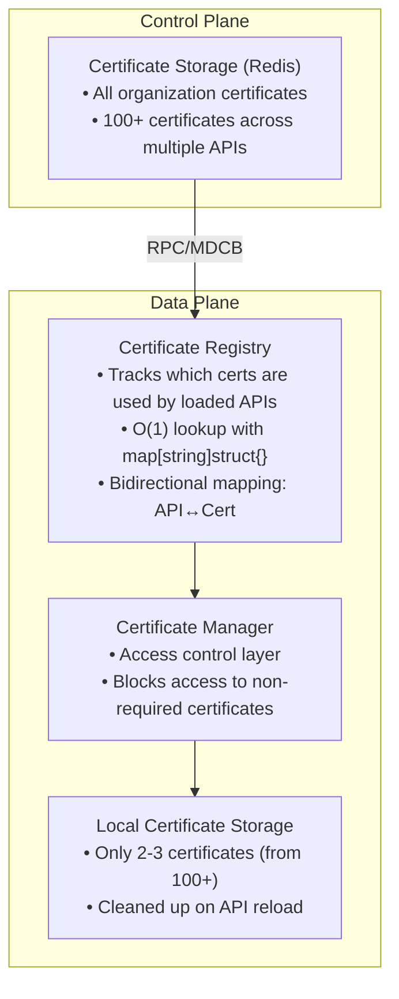
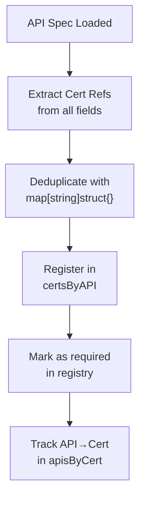
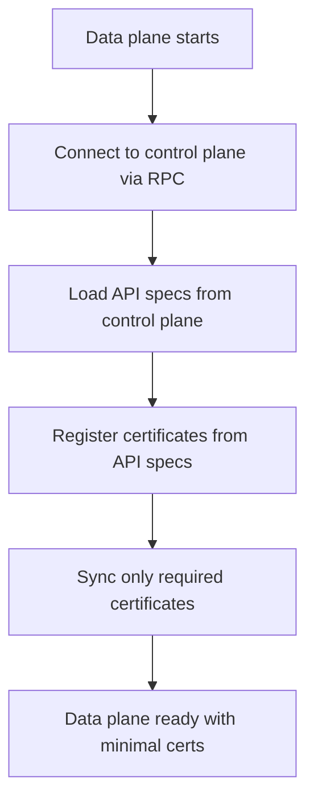
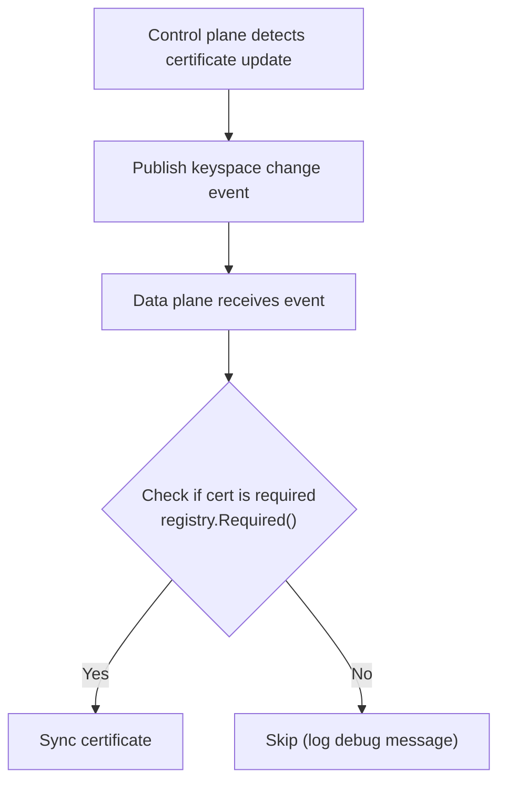
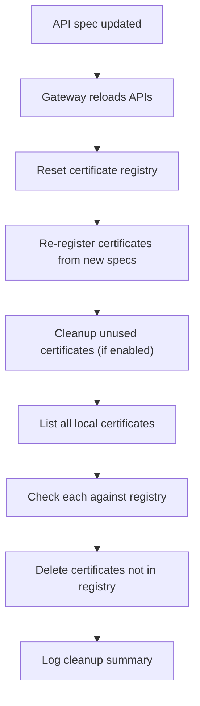

# Selective Certificate Synchronization for MDCB Data Planes

## Overview

This feature implements selective certificate synchronization for Tyk Gateway data planes in MDCB (Multi Data Center Bridge) deployments. Instead of syncing all certificates from the control plane, data planes now only sync certificates that are actually used by their loaded APIs.

**Benefits**:
- **97-98% reduction** in certificate storage on data planes
- **Reduced memory footprint** in segmented deployments
- **Faster synchronization** with fewer certificates to transfer
- **Improved security** with masked certificate IDs in logs
- **O(1) lookup performance** with optimized data structures

## Architecture

### Component Overview



### Key Components

#### 1. Certificate Registry (`gateway/cert_registry.go`)

The certificate registry is the core component that tracks which certificates are required by loaded APIs.

**Data Structures**:
```go
type certRegistry struct {
    mu         sync.RWMutex
    required   map[string]struct{}                // certID -> is required
    apisByCert map[string]map[string]struct{}     // certID -> set of API IDs
    certsByAPI map[string]map[string]struct{}     // API ID -> set of cert IDs
}
```

**Performance Characteristics**:
- **O(1)** lookup to check if a certificate is required
- **Zero-size** struct{} values for minimal memory footprint
- **Automatic deduplication** when APIs reference the same certificate multiple times
- **Thread-safe** with RWMutex for concurrent access

**Key Methods**:
- `Required(certID string) bool` - Check if a certificate is used by any loaded API
- `Register(spec *APISpec)` - Extract and track all certificates from an API spec
- `APIs(certID string) []string` - Get list of APIs using a specific certificate
- `Reset()` - Clear all tracked certificates (used during API reload)

#### 2. Certificate Manager (`certs/manager.go`)

Enhanced with selective sync support to enforce access control at the application layer.

**Key Changes**:
```go
type certificateManager struct {
    // ... existing fields ...

    // New fields for selective sync
    registry      CertRegistry  // Certificate usage registry
    selectiveSync bool          // Whether selective sync is enabled
}

// Access control enforcement
func (c *certificateManager) GetRaw(certID string) (string, error) {
    // Check registry before accessing storage when selective sync is enabled
    if c.selectiveSync && c.registry != nil && !c.registry.Required(certID) {
        c.logger.WithField("cert_id", maskCertID(certID)).
            Info("BLOCKED: certificate not required by loaded APIs")
        return "", errors.New("certificate not required by loaded APIs")
    }
    return c.storage.GetKey("raw-" + certID)
}
```

**Security Enhancement**:
- Certificate IDs are masked in logs: `a1b2c3d4***[len=72]`
- Prevents exposure of sensitive data derived from API keys

#### 3. RPC Storage Handler (`gateway/rpc_storage_handler.go`)

Filters certificate synchronization during keyspace changes.

**Implementation**:
```go
func (r *RPCStorageHandler) ProcessKeySpaceChanges(keys []string, orgId string) {
    // ... existing code ...

    // Filter certificates during sync
    if r.Gw.GetConfig().SlaveOptions.UseRPC &&
        r.Gw.GetConfig().SlaveOptions.SyncUsedCertsOnly {

        if r.Gw.certRegistry != nil && !r.Gw.certRegistry.Required(certId) {
            log.WithField("cert_id", maskCertID(certId)).
                Debug("skipping certificate - not used by loaded APIs")
            continue
        }

        if r.Gw.certRegistry != nil {
            apis := r.Gw.certRegistry.APIs(certId)
            log.WithFields(logrus.Fields{
                "cert_id": maskCertID(certId),
                "apis":    apis,
            }).Info("syncing required certificate")
        }
    }

    // ... sync the certificate ...
}
```

#### 4. MDCB Storage Layer (`storage/mdcb_storage.go`)

Filters certificate pulls from MDCB based on registry.

**Implementation**:
```go
func (m MdcbStorage) GetKey(key string) (string, error) {
    resourceType := m.extractResourceType(key)

    // Filter certificate pulls
    if resourceType == resourceCertificate &&
        m.config != nil &&
        m.config.SlaveOptions.UseRPC &&
        m.config.SlaveOptions.SyncUsedCertsOnly &&
        m.certUsage != nil {

        certID := extractCertID(key)
        if certID == "" {
            return m.getFromRPCAndCache(key)
        }

        if !m.certUsage.Required(certID) {
            m.logger.WithField("cert_id", maskCertID(certID)).
                Debug("skipping certificate pull - not used by loaded APIs")
            return "", errors.New("certificate not required")
        }
    }

    return m.getFromRPCAndCache(key)
}
```

#### 5. Certificate Cleanup (`gateway/cert.go`)

Removes unused certificates after API reload.

**Implementation**:
```go
func (gw *Gateway) cleanupUnusedCerts() {
    // Registry only exists in RPC mode
    if gw.certRegistry == nil {
        return
    }

    // All three flags required (RPC mode + both features enabled)
    if !gw.GetConfig().SlaveOptions.UseRPC ||
        !gw.GetConfig().SlaveOptions.SyncUsedCertsOnly ||
        !gw.GetConfig().SlaveOptions.CleanupCerts {
        return
    }

    // List all certificates
    allCerts := gw.CertificateManager.ListAllIds("")

    var removed int
    for _, certID := range allCerts {
        if gw.certRegistry.Required(certID) {
            continue
        }

        // Extract orgID from certID (format: {orgID}{sha256hash})
        var orgID string
        if len(certID) > sha256.Size*2 {
            orgID = certID[:len(certID)-sha256.Size*2]
        }

        log.WithField("cert_id", maskCertID(certID)).
            Debug("removing unused certificate")

        gw.CertificateManager.Delete(certID, orgID)
        gw.RPCCertCache.Delete("cert-raw-" + certID)
        removed++
    }

    if removed > 0 {
        log.WithField("count", removed).Info("cleaned up unused certificates")
    }
}
```

#### 6. API Loader (`gateway/api_loader.go`)

Registers API certificates with the registry after loading APIs.

**Implementation**:
```go
func (gw *Gateway) loadApps(specs []*APISpec) {
    // ... existing API loading code ...

    // Register certificates from each API
    if gw.certRegistry != nil {
        for _, spec := range specs {
            gw.certRegistry.Register(spec)
        }

        // Log when feature is enabled
        if gw.GetConfig().SlaveOptions.SyncUsedCertsOnly {
            mainLog.WithFields(logrus.Fields{
                "cert_count": gw.certRegistry.Len(),
                "api_count":  len(specs),
            }).Info("sync used certs only enabled")
        }
    }
}
```

#### 7. Certificate Expiry Monitoring (`internal/certcheck/batcher.go`)

Optimized to skip expiry checks for unused certificates.

**Implementation**:
```go
func (c *CertificateExpiryCheckBatcher) RunInBackground() {
    // ... existing code ...

    for certInfo := range c.batch.Iter() {
        // ONLY filter in RPC mode when feature enabled
        if c.gwConfig != nil &&
            c.gwConfig.SlaveOptions.UseRPC &&
            c.gwConfig.SlaveOptions.SyncUsedCertsOnly &&
            c.certUsage != nil {

            if !c.certUsage.Required(certInfo.ID) {
                continue
            }
        }

        // ... perform expiry check ...
    }
}
```

## Configuration

### Config Options

Two new configuration flags in `SlaveOptionsConfig`:

```json
{
  "slave_options": {
    "use_rpc": true,
    "sync_used_certs_only": false,
    "cleanup_certs": false
  }
}
```

#### `sync_used_certs_only`
- **Type**: `boolean`
- **Default**: `false`
- **Description**: Set to `true` to sync only certificates used by loaded APIs. Only applies when `use_rpc` is `true`. Reduces memory usage and log noise in segmented deployments.

#### `cleanup_certs`
- **Type**: `boolean`
- **Default**: `false`
- **Description**: Set to `true` to remove unused certificates on API reload. Only applies when both `use_rpc` and `sync_used_certs_only` are `true`.

### Example Configuration

**Control Plane** (no changes required):
```json
{
  "listen_port": 8080,
  "storage": {
    "type": "redis",
    "host": "localhost",
    "port": 6379
  }
}
```

**Data Plane** (with selective sync enabled):
```json
{
  "listen_port": 8080,
  "slave_options": {
    "use_rpc": true,
    "rpc_key": "your-rpc-key",
    "connection_string": "control-plane:9091",
    "sync_used_certs_only": true,
    "cleanup_certs": true,
    "bind_to_slugs": true,
    "group_id": "datacenter-1"
  },
  "storage": {
    "type": "redis",
    "host": "localhost",
    "port": 6379
  }
}
```

## Certificate Tracking

### Certificate Sources

The registry tracks certificates from multiple API spec fields:

1. **`Certificates`** - Server certificates for custom domains
2. **`ClientCertificates`** - Client certificates for mutual TLS
3. **`UpstreamCertificates`** - Certificates for upstream mutual TLS
4. **`PinnedPublicKeys`** - Public key pinning for certificate validation

### Registration Flow



## Synchronization Flow

### Initial Sync



### Live Sync (Keyspace Changes)



### API Reload



## Performance Optimizations

### 1. Zero-Size Set Values

Using `struct{}` instead of `bool` for set implementations:

```go
// Before: 1 byte per entry
required map[string]bool

// After: 0 bytes per entry
required map[string]struct{}
```

**Memory Savings**:
- 10,000 certificates = **10KB saved** on required map alone
- In large deployments: **hundreds of KB to MB saved**

### 2. O(1) Lookup Performance

Replaced linear scans with map lookups:

```go
// Before: O(N) - scan slice for each check
func contains(slice []string, item string) bool {
    for _, a := range slice {
        if a == item {
            return true
        }
    }
    return false
}

// After: O(1) - direct map lookup
func (cr *certRegistry) Required(certID string) bool {
    _, exists := cr.required[certID]
    return exists
}
```

### 3. Automatic Deduplication

Certificates referenced multiple times in an API spec are automatically deduplicated:

```go
// API spec with duplicate cert references
spec := APISpec{
    Certificates:         []string{"cert1", "cert1"},
    ClientCertificates:   []string{"cert1"},
    UpstreamCertificates: map[string]string{"*": "cert1"},
}

// Registry stores only one reference
certSet := make(map[string]struct{})
certSet["cert1"] = struct{}{}  // Only one entry
```

## Security Considerations

### Certificate ID Masking

Certificate IDs can be derived from API keys and should not be logged in clear text.

**Implementation**:
```go
func maskCertID(certID string) string {
    if len(certID) <= 8 {
        return certID
    }
    return certID[:8] + "***[len=" + strconv.Itoa(len(certID)) + "]"
}

// Usage
log.WithField("cert_id", maskCertID(certID)).
    Info("syncing required certificate")

// Output: cert_id=a1b2c3d4***[len=72]
```

**Where Applied**:
- `certs/manager.go` - GetRaw() access control logs
- `gateway/cert.go` - Cleanup operation logs
- `gateway/rpc_storage_handler.go` - Sync operation logs
- `storage/mdcb_storage.go` - Storage layer logs

### Access Control

The CertificateManager enforces access control at the application layer:

1. **Registry Check**: Before accessing any certificate, check if it's required
2. **Block Non-Required**: Return error if certificate is not in registry
3. **Audit Logging**: Log all blocked access attempts with masked cert IDs

This ensures that even if a certificate exists in storage, it cannot be accessed unless it's registered as required by a loaded API.

## Testing

### Unit Tests

All core packages have comprehensive unit tests:

```bash
# Certificate manager tests
go test ./certs -v

# Storage layer tests
go test ./storage -v

# Certificate expiry monitoring tests
go test ./internal/certcheck -v

# Config schema validation tests
go test ./cli/linter -v
```

### Integration Tests

Certificate-specific integration tests:

```bash
# All certificate integration tests
go test ./gateway -run TestCert -v

# Specific certificate features
go test ./gateway -run TestCertificateCheckMW -v
go test ./gateway -run TestAPICertificate -v
go test ./gateway -run TestUpstreamCertificates -v
```

### Manual Testing

See `MDCB.md` for step-by-step manual testing procedures including:
- Setting up control plane and data plane
- Uploading 100+ test certificates
- Verifying selective sync (97-98% reduction)
- Testing certificate cleanup
- Verifying access control

## Monitoring and Observability

### Log Messages

**INFO Level**:
```
info msg="sync used certs only enabled" cert_count=2 api_count=1
info msg="syncing required certificate" cert_id=a1b2c3d4***[len=72] apis=["api1","api2"]
info msg="cleaned up unused certificates" count=98
```

**DEBUG Level**:
```
debug msg="skipping certificate - not used by loaded APIs" cert_id=a1b2c3d4***[len=72]
debug msg="skipping certificate pull - not used by loaded APIs" cert_id=a1b2c3d4***[len=72]
debug msg="removing unused certificate" cert_id=a1b2c3d4***[len=72]
```

**BLOCKED Attempts**:
```
info msg="BLOCKED: certificate not required by loaded APIs" cert_id=a1b2c3d4***[len=72]
```

### Metrics

Monitor these aspects:

1. **Certificate Count**:
   - Before: 100+ certificates in storage
   - After: 2-3 certificates in storage
   - Reduction: 97-98%

2. **Memory Usage**:
   - Registry memory: ~0 bytes per certificate (struct{})
   - Storage reduction: ~MB per 1000 unused certificates

3. **Sync Performance**:
   - Fewer certificates to sync = faster sync time
   - O(1) lookup for filtering decisions

## Backward Compatibility

The feature is **100% backward compatible**:

1. **Disabled by Default**: Both `sync_used_certs_only` and `cleanup_certs` default to `false`
2. **No Breaking Changes**: Existing deployments continue to work as before
3. **Opt-In**: Enable the feature when ready by updating configuration
4. **Gradual Rollout**: Can be enabled per data plane, not all at once

## Migration Guide

### Enabling Selective Sync

**Step 1**: Update data plane configuration
```json
{
  "slave_options": {
    "use_rpc": true,
    "sync_used_certs_only": true
  }
}
```

**Step 2**: Restart data plane gateway

**Step 3**: Verify in logs
```
info msg="sync used certs only enabled" cert_count=X api_count=Y
```

**Step 4**: Enable cleanup (optional)
```json
{
  "slave_options": {
    "use_rpc": true,
    "sync_used_certs_only": true,
    "cleanup_certs": true
  }
}
```

**Step 5**: Reload APIs to trigger cleanup
```bash
# Send reload signal to gateway
curl -X POST http://localhost:8080/tyk/reload/ \
  -H "X-Tyk-Authorization: {your-secret}"
```

**Step 6**: Verify cleanup in logs
```
info msg="cleaned up unused certificates" count=X
```

## Troubleshooting

### Certificate Not Found

**Symptom**: API returns certificate errors after enabling selective sync

**Cause**: Certificate might be referenced in API spec but not properly registered

**Solution**:
1. Check API spec for certificate references
2. Verify certificate ID is correct
3. Check logs for "BLOCKED" messages
4. Ensure certificate is actually needed by the API

### Certificates Not Being Cleaned Up

**Symptom**: Old certificates remain after API reload

**Possible Causes**:
1. `cleanup_certs` is not enabled
2. `sync_used_certs_only` is not enabled
3. Certificate is still required by another API
4. API reload hasn't been triggered

**Solution**:
1. Verify both flags are enabled in config
2. Check `certRegistry.Required(certID)` returns false
3. Trigger explicit API reload
4. Check logs for cleanup messages

### High Memory Usage

**Symptom**: Memory usage higher than expected

**Possible Causes**:
1. Many APIs sharing many certificates (expected behavior)
2. Registry not being reset on API reload
3. Certificates not being cleaned up

**Solution**:
1. Check registry size: `len(required)` should match actual certificate needs
2. Enable `cleanup_certs` to remove unused certificates
3. Monitor cleanup logs after API reload

## Future Enhancements

Potential improvements for future versions:

1. **Certificate Usage Analytics**:
   - Track which certificates are most commonly used
   - Report on unused certificates in control plane

2. **Certificate Lifecycle Management**:
   - Automatic cleanup of expired certificates
   - Proactive renewal notifications

3. **Advanced Filtering**:
   - Filter by organization
   - Filter by API tags or categories

4. **Performance Metrics**:
   - Export certificate count metrics
   - Track sync performance improvements

5. **Administrative API**:
   - Query certificate usage via API
   - Force sync specific certificates on demand

## References

- **PR**: `poc/selective-certificate-sync`
- **Issue**: Selective certificate synchronization for MDCB
- **Files Changed**: 20 files (+482, -43)
- **Commits**: 6 commits covering feature, security, and performance

### Key Files

- `gateway/cert_registry.go` - Certificate registry implementation
- `gateway/cert.go` - Certificate cleanup logic
- `certs/manager.go` - Access control enforcement
- `storage/mdcb_storage.go` - Storage layer filtering
- `gateway/rpc_storage_handler.go` - RPC sync filtering
- `internal/certcheck/batcher.go` - Expiry check optimization
- `config/config.go` - Configuration options
