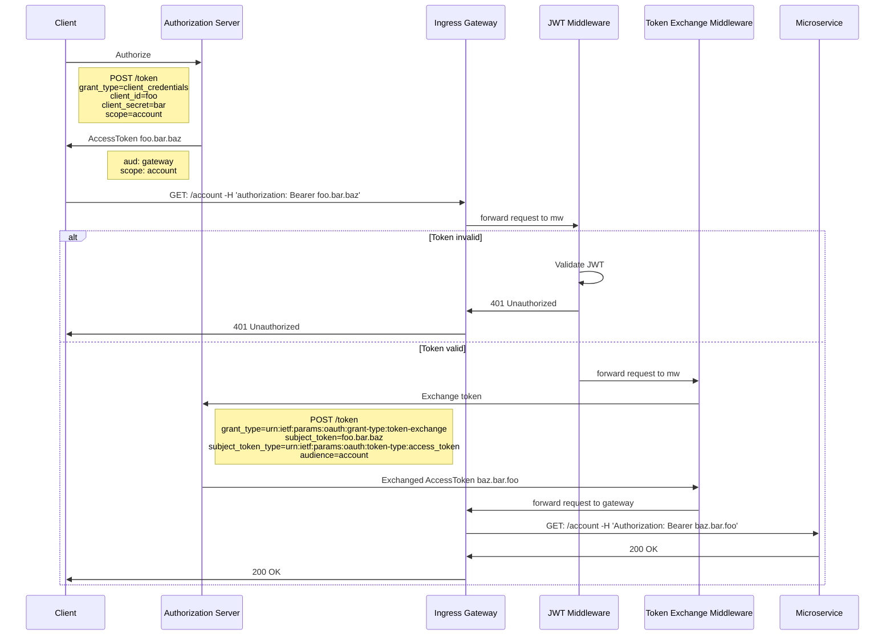

```mermaid
sequenceDiagram
    participant Client
    participant AS as Authorization Server
    participant Tyk as Ingress Gateway
    participant JWTMW as JWT Middleware
    participant TokenExchangeMW as Token Exchange Middleware
    participant MS as Microservice

    Client->>AS: Authorize
    note left of AS: POST /token<br />grant_type=client_credentials<br />client_id=foo<br />client_secret=bar<br />scope=account
    AS->>Client: AccessToken foo.bar.baz
    note left of AS: aud: gateway<br />scope: account
    Client->>Tyk: GET: /account -H 'authorization: Bearer foo.bar.baz'
    Tyk->>JWTMW: forward request to mw
    alt Token invalid
        JWTMW->>JWTMW: Validate JWT
        JWTMW->>Tyk: 401 Unauthorized
        Tyk->>Client: 401 Unauthorized
    else Token valid
        JWTMW->>TokenExchangeMW: forward request to mw
        TokenExchangeMW->>AS: Exchange token
        note right of AS: POST /token<br />grant_type=urn:ietf:params:oauth:grant-type:token-exchange<br />subject_token=foo.bar.baz<br />subject_token_type=urn:ietf:params:oauth:token-type:access_token<br />audience=account
        AS->>TokenExchangeMW: Exchanged AccessToken baz.bar.foo
        TokenExchangeMW->>Tyk: forward request to gateway
        Tyk->>MS: GET: /account -H 'Authorization: Bearer baz.bar.foo'
        MS->>Tyk: 200 OK
        Tyk->>Client: 200 OK
    end
```