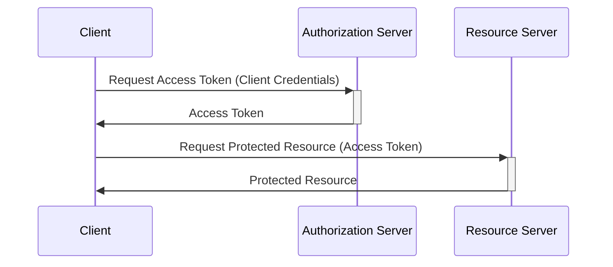
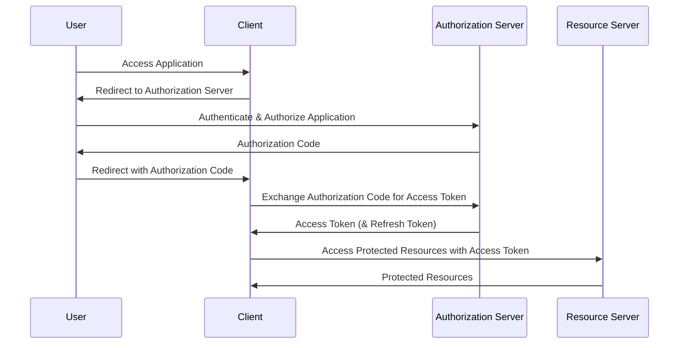
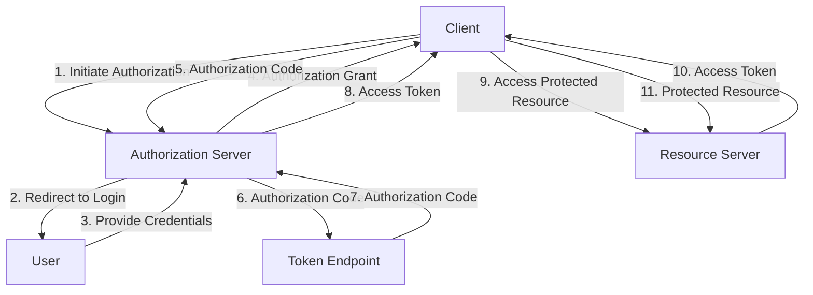
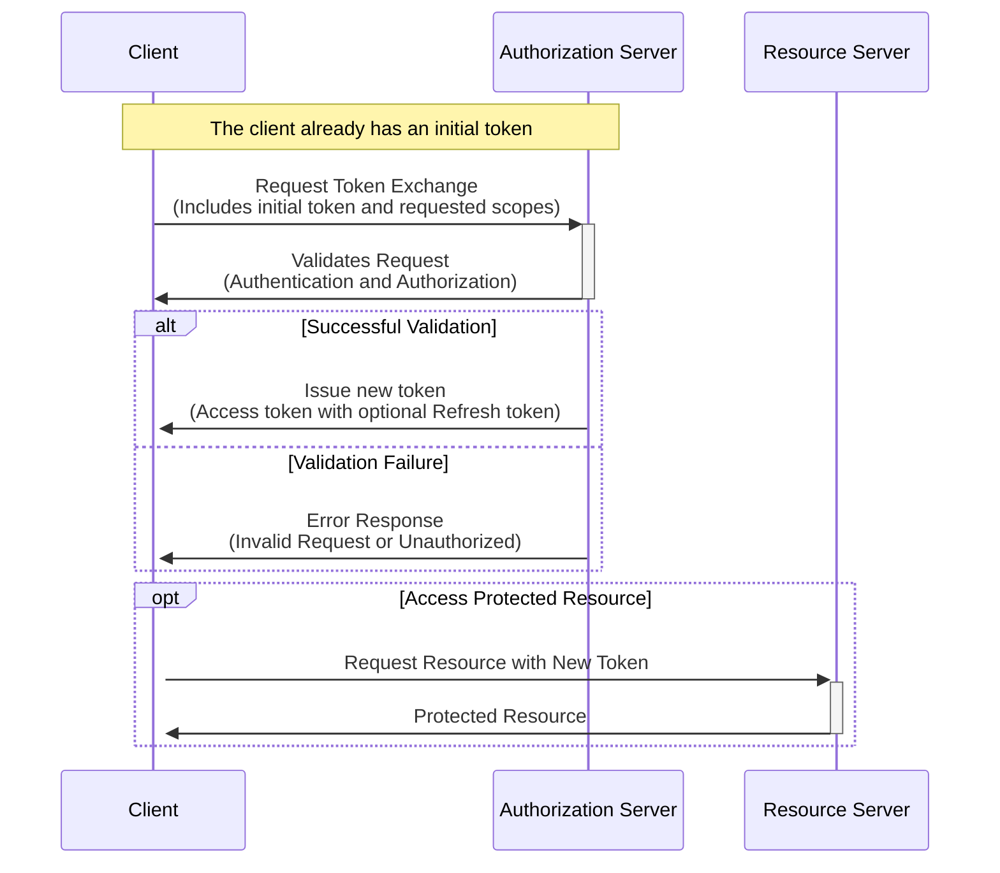
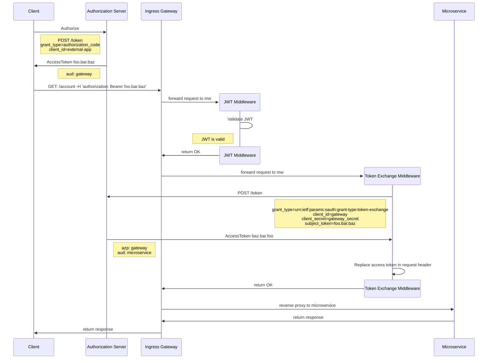

```
docker run -d --name keycloak -v ./keycloak/data:/opt/keycloak/data/h2  -p 8081:8080 -e KEYCLOAK_ADMIN=admin -e KEYCLOAK_ADMIN_PASSWORD=admin -e KC_FEATURES=preview  quay.io/keycloak/keycloak:23.0.6 start-dev --features=preview
```











