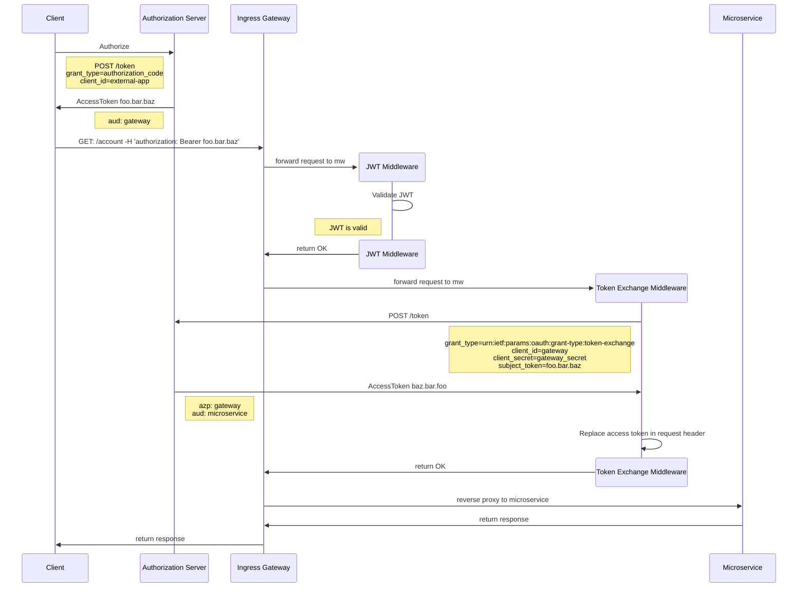

```mermaid
sequenceDiagram
    participant Client
    participant AS as Authorization Server
    participant Tyk as Ingress Gateway
    

    Client->>AS: Authorize
    note left of AS: POST /token<br />grant_type=authorization_code<br />client_id=external-app
    AS->>Client: AccessToken foo.bar.baz
    note left of AS: aud: gateway
    Client->>Tyk: GET: /account -H 'authorization: Bearer foo.bar.baz'
    create participant JWTMW as JWT Middleware
    Tyk->>JWTMW: forward request to mw
    JWTMW->JWTMW: Validate JWT
    note left of JWTMW: JWT is valid
    destroy JWTMW
    JWTMW->>Tyk: return OK
    create participant TokenExchangeMW as Token Exchange Middleware
    Tyk->>TokenExchangeMW: forward request to mw
    TokenExchangeMW->>AS: POST /token
    note left of TokenExchangeMW: <br />grant_type=urn:ietf:params:oauth:grant-type:token-exchange<br />client_id=gateway<br />client_secret=gateway_secret<br />subject_token=foo.bar.baz
    AS->>TokenExchangeMW: AccessToken baz.bar.foo
    note right of AS: azp: gateway<br />aud: microservice
    TokenExchangeMW->>TokenExchangeMW: Replace access token in request header
    destroy TokenExchangeMW
    TokenExchangeMW->>Tyk: return OK
    participant MS as Microservice
    Tyk->>MS: reverse proxy to microservice
    MS->>Tyk: return response
    Tyk->>Client: return response
```
